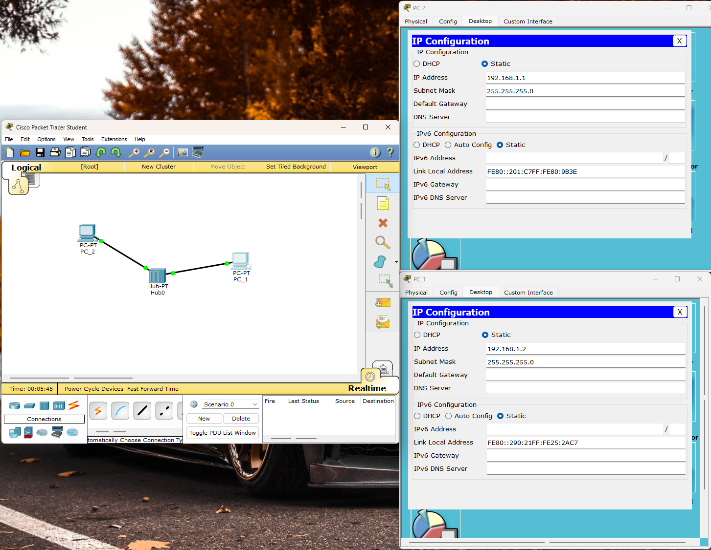
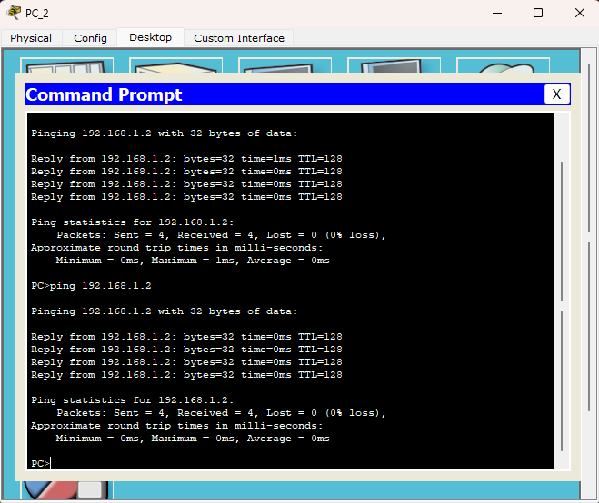
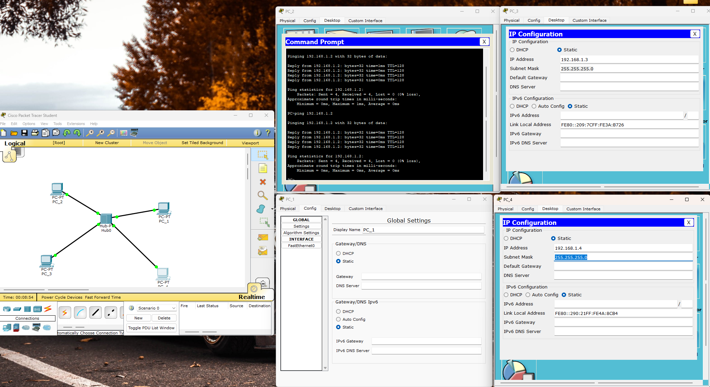
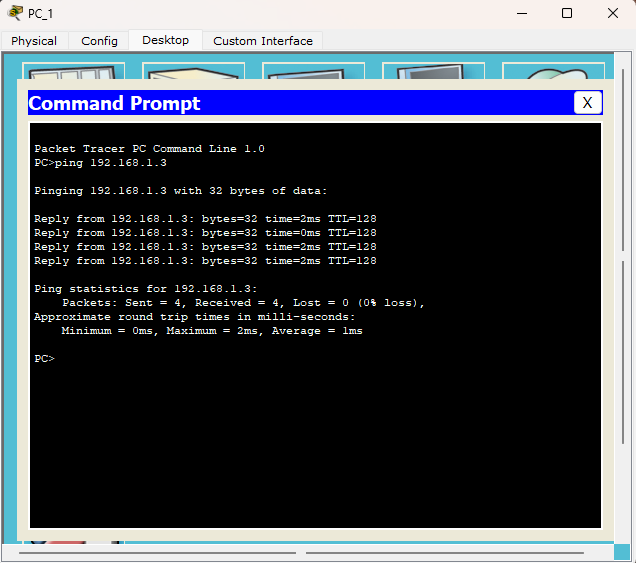

# Лабораторная 1

**Используют ли сейчас хабы? Почему?**

**Нет, в современных сетях концентраторы (хабы) практически не используются.**

**Причины:**

1. **Низкая производительность и безопасность:**Хаб работает на физическом уровне (Layer 1) модели OSI и просто повторяет все входящие данные на*все*свои порты. Это создает избыточный трафик и "коллизии" (столкновения пакетов), что сильно замедляет работу сети. Кроме того, любой компьютер в сети может "прослушивать" весь чужой трафик, что небезопасно.
2. **Полное вытеснение коммутаторами (свитчами):**Коммутатор работает на канальном уровне (Layer 2). Он "интеллектуальнее" — он изучает MAC-адреса устройств и отправляет данные только на тот порт, к которому подключен адресат. Это делает сеть быстрее, безопаснее и эффективнее. Сегодня свитчи стоят так же дешево, как когда-то хабы, поэтому у последних не осталось преимуществ.

**Вывод:**Хаб — это устаревшее устройство, которое можно встретить только в очень старых сетях или в учебных целях (как в нашей лабораторной работе).