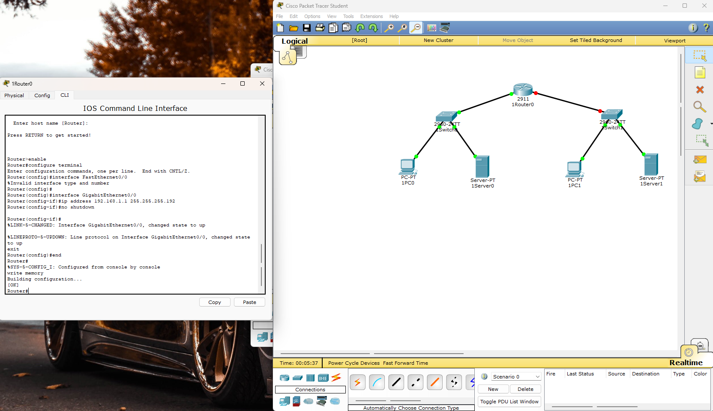
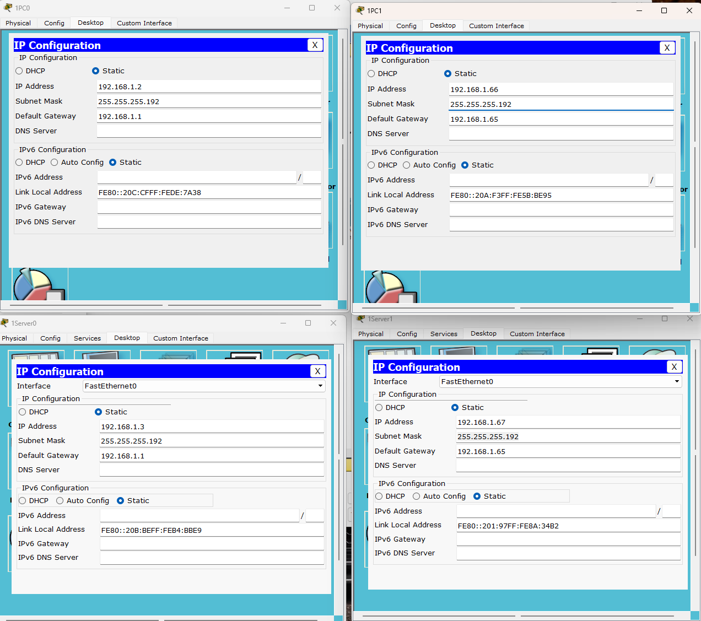
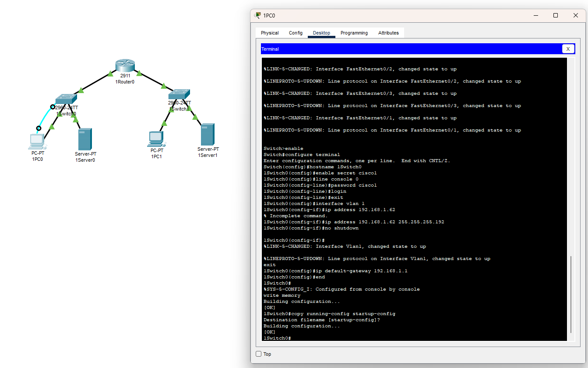
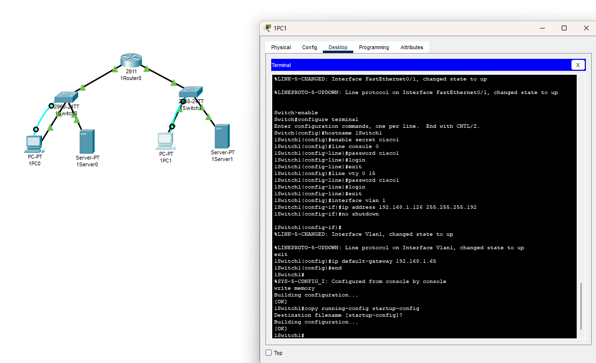
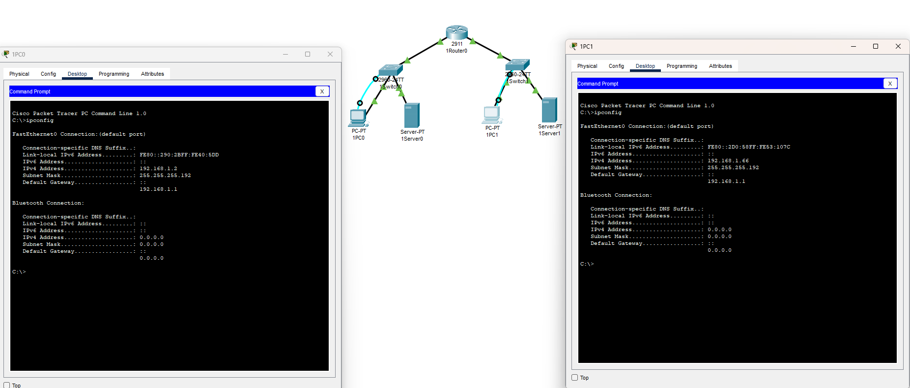
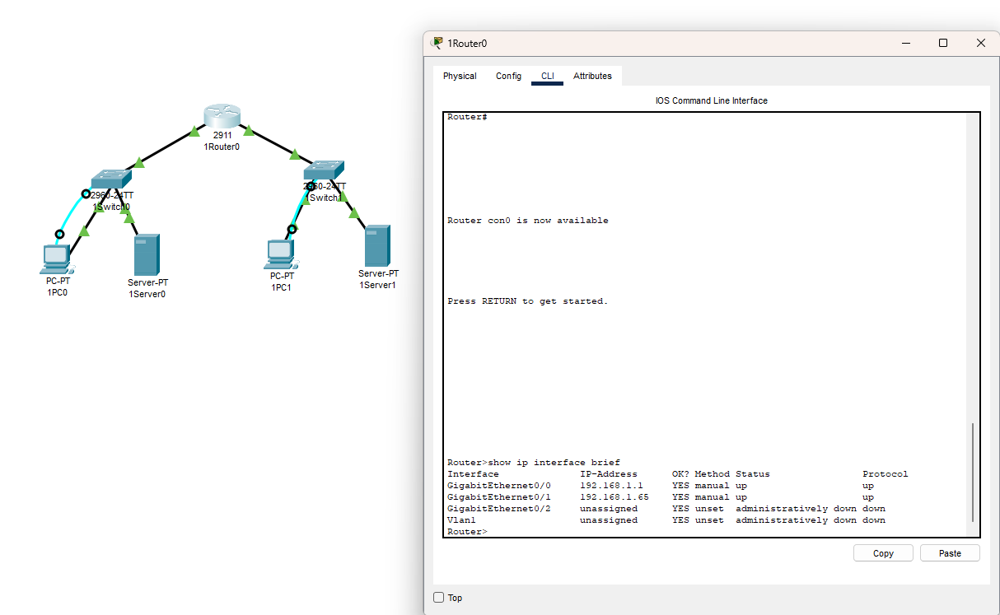
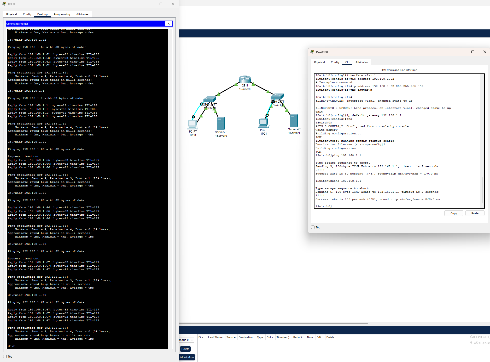

# Лабораторная 2

Арес сети: 192.168.1.0

Маска сети: 255.255.255.0

Количество подсетей: 3
Названия устройств: 1SwitchX, 1PCX, cisco1

Т.к. нам нужно 3 подсети, 2^1 = 2 - мало, 2^2 = 4 - достаточно ⇒ число разрядов подсети 2

Исходная маска /24 (255.255.255.0), новая маска /26 (задействовали 2 бита из узловой части) значит новая маска подсети 255.255.255.192

Первые 3 подсети:

| № | Адрес подсети | Первый IP-адрес | Последний IP-адрес | Широковещательный адрес | Количество узлов |
| --- | --- | --- | --- | --- | --- |
| 0 | 192.168.1.0 | 192.168.1.1 | 192.168.1.62 | 192.168.1.63 | 62 |
| 1 | 192.168.1.64 | 192.168.1.65 | 192.168.1.126 | 192.168.1.127 | 62 |
| 2 | 192.168.1.128 | 192.168.1.129 | 192.168.1.190 | 192.168.1.191 | 62 |
| 3 | 192.168.1.192 | 192.168.1.193 | 192.168.1.254 | 192.168.1.255 | 62 |
- **Подсеть 0**(192.168.1.0/26) - для левой сети (Fa0/0 маршрутизатора).
- **Подсеть 1**(192.168.1.64/26) - для правой сети (Fa0/1 маршрутизатора).

1. **Помогает ли разделение на подсети уменьшить проблему нехватки IP-адресов?**
    - **Нет, не помогает.**Оно, наоборот, "дробит" адресное пространство, уменьшая количество полезных адресов в каждой подсети из-за сетевого и широковещательного адресов. Для борьбы с нехваткой адресов используется NAT (трансляция сетевых адресов) и IPv6.
2. **Создает ли это ситуацию, когда IP-адреса могли бы использоваться непродуктивно?**
    - **Да.**Если в подсети для 30 ПК выделить блок на 62 узла (/26), то 32 адреса будут простаивать. Это важно, так как ведет к нерациональному использованию ограниченного пространства IPv4-адресов.
3. **Явилось бы использование VLSM выгодным вариантом?**
    - **Да, очень выгодным.**VLSM позволяет создавать подсети разного размера. Например, для беспроводной сети на 30 ПК можно выделить подсеть`/27`(30 узлов), а для связи "маршрутизатор-коммутатор" — подсеть`/30`(2 узла). Это экономит адреса.
4. **Почему нужно назначить IP-адрес именно интерфейсу VLAN1?**
    - Интерфейс VLAN 1 — это интерфейс управления по умолчанию. IP-адрес на нем позволяет удаленно управлять коммутатором (через Telnet/SSH) из любой подсети, к которой подключен его шлюз. Физические порты (Fa0/1 и др.) не имеют собственных IP-адресов, они являются частью VLAN.
5. **Какая команда требуется для активизации идентификации с помощью пароля?**
    - Команда`login`в режиме конфигурации линии (`line console 0`/`line vty 0 15`).
6. **Сколько гигабитных портов доступно на коммутаторе 2950-24?**
    - На стандартном`2950-24`—**0**гигабитных портов. Все 24 порта — FastEthernet (100 Мбит/с). Две маленькие портативные платы расширения сверху — это гигабитные порты (могут быть добавлены опционально).
7. **Выведите на экран таблицу IP-маршрутизации для маршрутизатора. Какие маршруты известны и как они были получены?**
    - Команда:`show ip route`
    - **Будут известны:**
        - `C 192.168.1.0/26 is directly connected, GigabitEthernet0/0`(Подсеть 0)
        - `C 192.168.1.64/26 is directly connected, GigabitEthernet0/1`(Подсеть 1)
    - **Как получены:**`C`—`Connected`(подключенные). Маршрутизатор автоматически добавляет в таблицу сети, к которым он подключен напрямую.