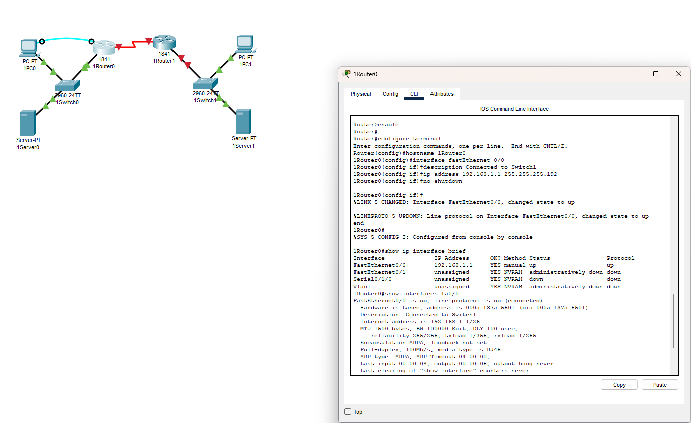
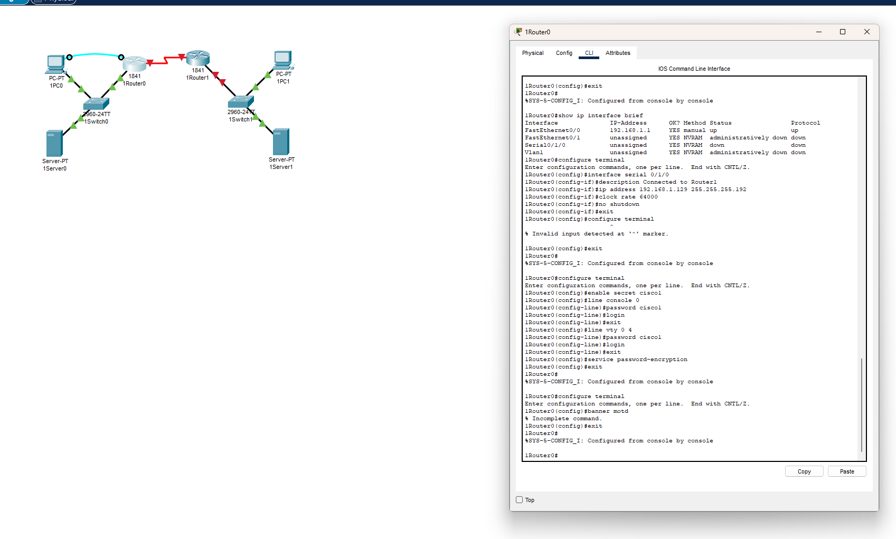
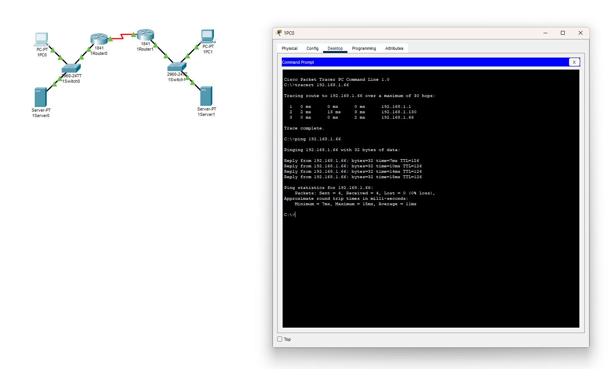
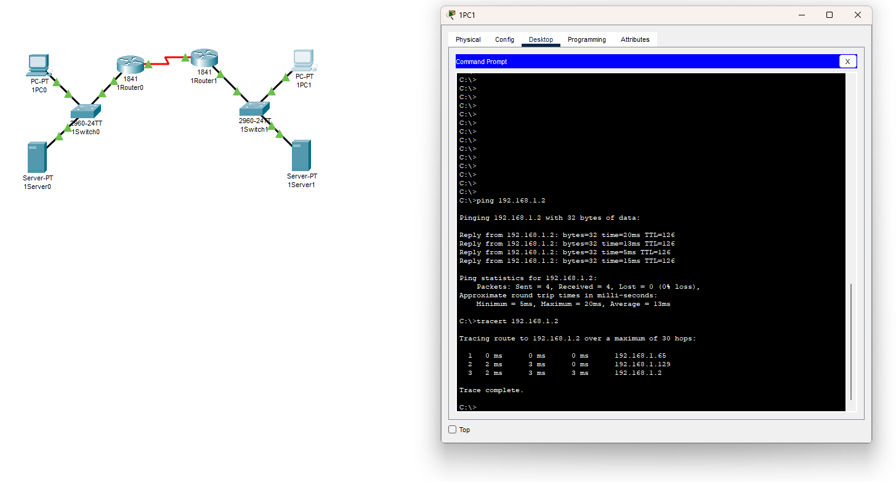
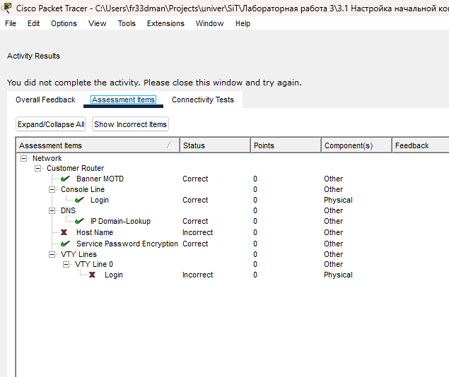

# Лабораторная 3











я не совсем понял как пройти все тесты - я по разному пробовал переименовывать хосты - ни в какой вариации host name и vty line login не прошли, хотя все вроде настраивал по методичке

```
1Router2#show running-config | include hostname
hostname 1Router2
1Router2#show running-config | section line vty
line vty 0 4
```

### **Ответы на вопросы для самопроверки (ключевые):**

1. **Часто используемые команды:**`enable`,`configure terminal`,`interface`,`ip address`,`no shutdown`,`show running-config`,`copy running-config startup-config`.
2. **Повышение безопасности паролей:**Использовать`enable secret`(шифрует MD5), а не`enable password`. Использовать`service password-encryption`. Запретить Telnet, использовать только SSH (`line vty`+`transport input ssh`).
3. **Отключение поиска DNS:**`no ip domain-lookup`в глобальной конфигурации.
4. **Ping на IP локальной сети Router2:**Успешен, если интерфейс Router2 включен (`no shutdown`), даже если ПК в той сети нет.
5. **Режим для настройки описания интерфейса:**Режим конфигурации интерфейса (`config-if`).
6. **Проверка настроек интерфейса:**`show interfaces [тип номер]`или`show ip interface brief`.
7. **Интерфейс отключается после перезагрузки:**Конфигурация не была сохранена (`copy running-config startup-config`).
8. **Путь от пользовательского режима к config-if для FA0/1:**
    
    ```bash
    enable
    configure terminal
    interface fastEthernet 0/1
    ```
    
9. **Команда`clock rate`:**Используется только на концеDCE последовательного кабеля.