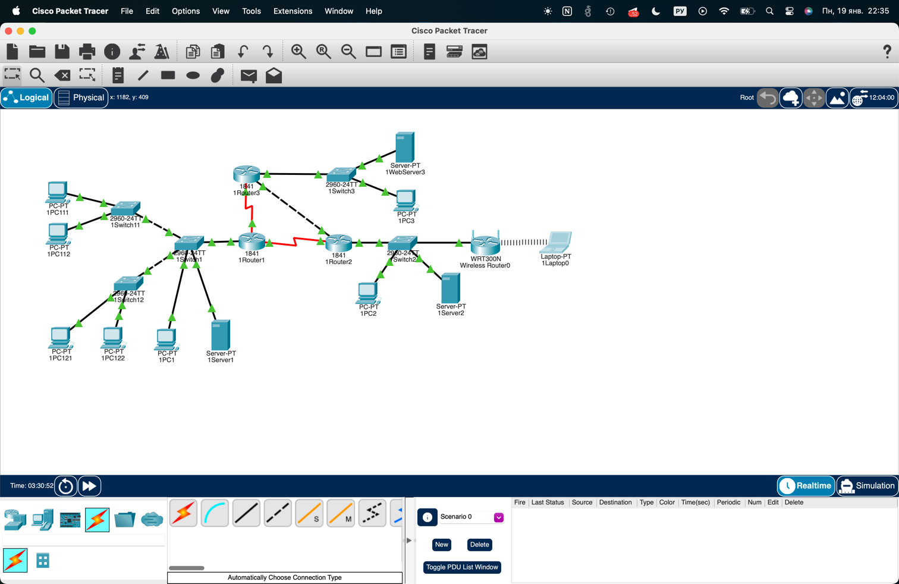
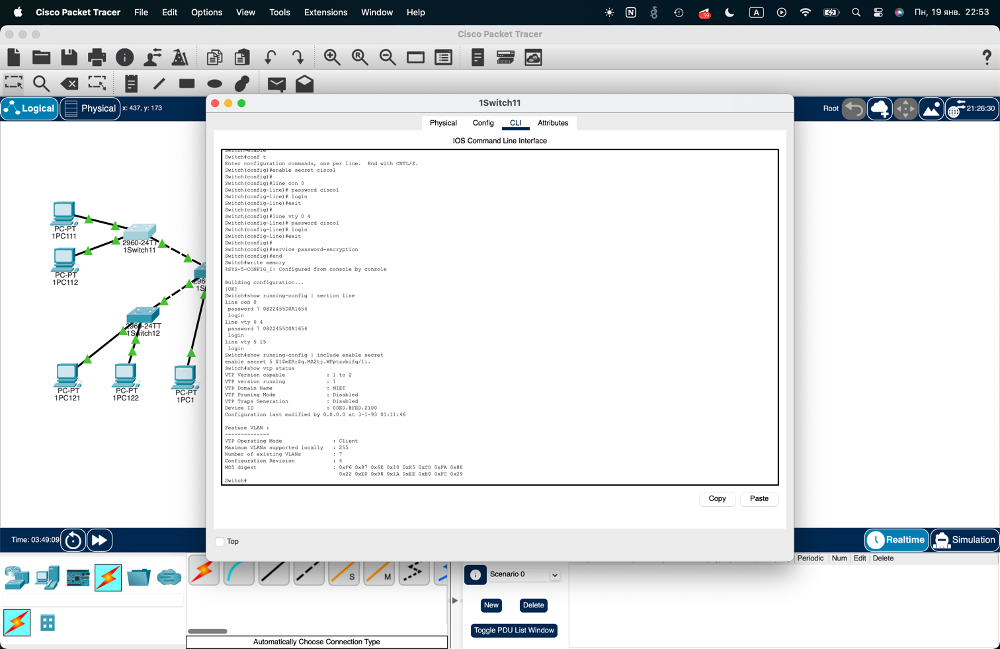
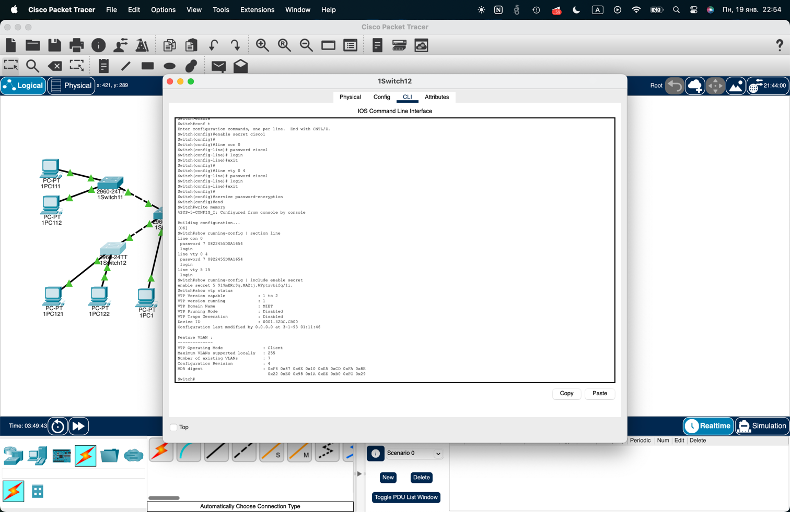
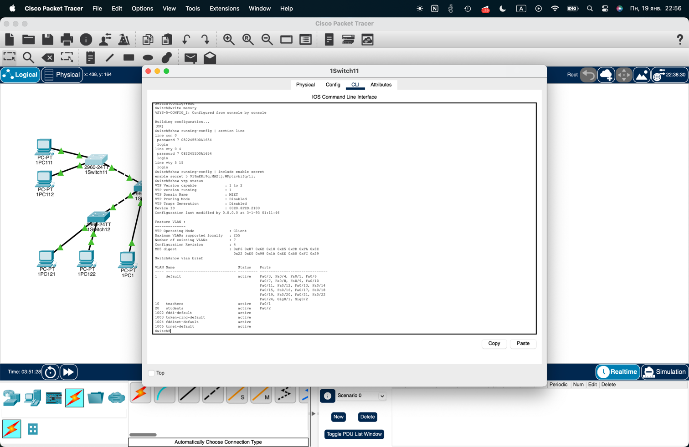
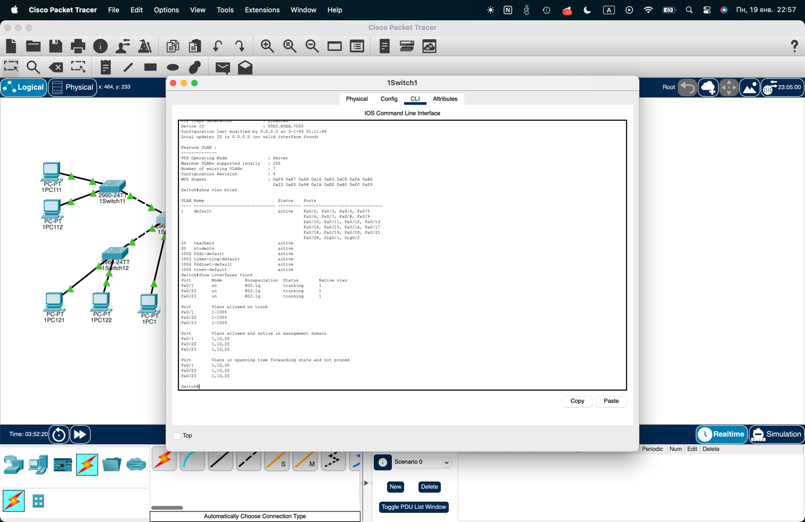
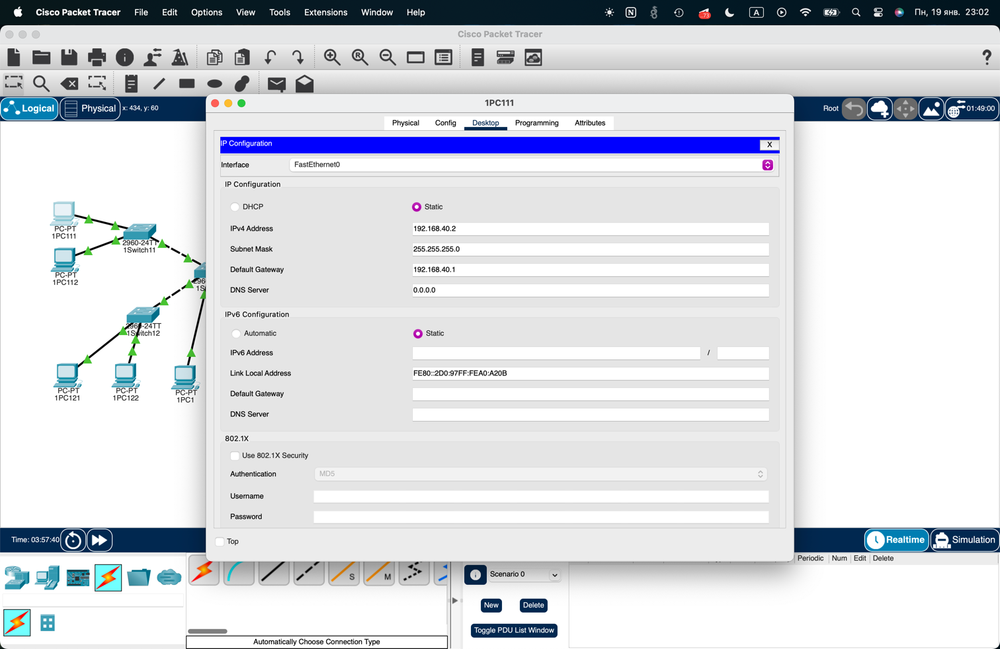
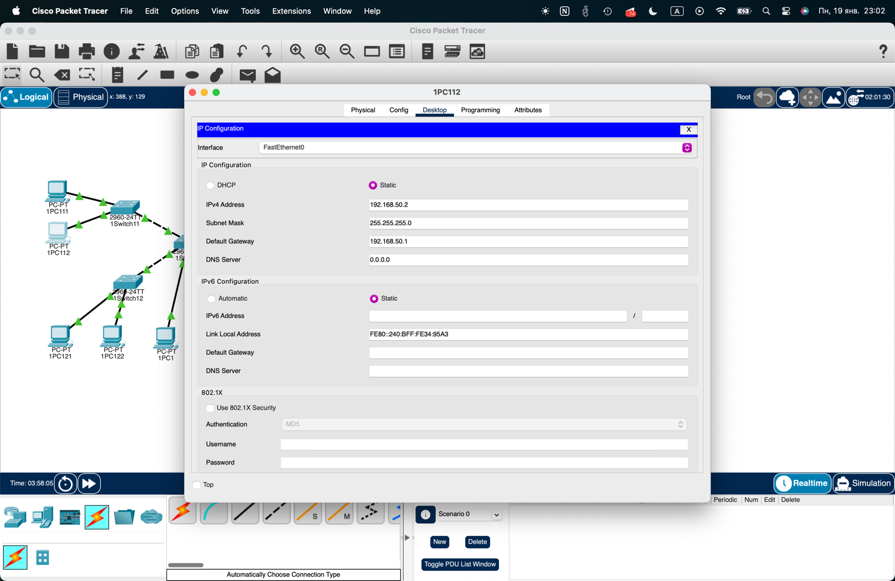
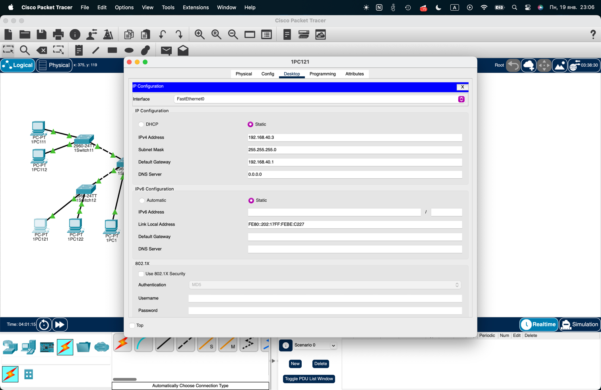
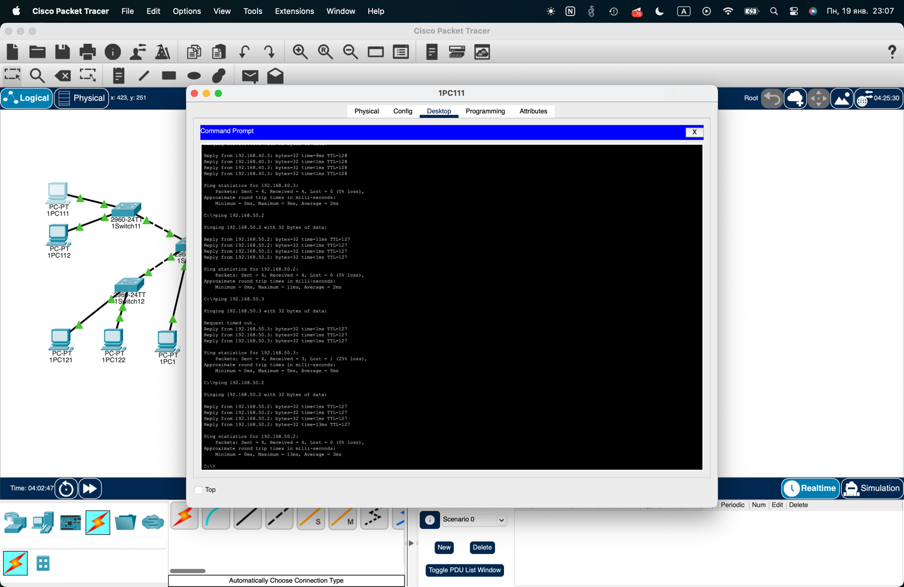

## Лабораторная 6 — VLAN / VTP

### Схема сети

## VTP

### VTP сервер 1Switch1

### VTP клиент 1Switch11

### VTP клиент 1Switch12

## VLAN

### VLAN 10/20 созданы на сервере

### VLAN 10/20 видны на клиентах

## Trunk

### Trunk‑порты

## Access‑порты

### Порты доступа на 1Switch11

### Порты доступа на 1Switch12

## Router‑on‑a‑Stick

### Подинтерфейсы на 1Router1

## IP адреса хостов

### IP конфиг PC111/PC112

### IP конфиг PC121/PC122

## Проверка

### Пинг между VLAN 10 и VLAN 20

> *Примечание:
> Только в macos я в packet tracer наконец таки смог успешно сохранить свою конфигурацию, она лежит
> в `lab_6_configuration.pkt`, на windows при сохранении CPT вылетал и весь проект терялся, 
> поэтому мне приходилось работать без сохранений и не выключать комп. К сожалению
> все предыдущие лабы остаются без снапшотов, ну хотя бы начиная с этой снапшоты будут.*

## Ответы на вопросы для самопроверки

1. **Можно ли задать коммутатору IP‑адрес?** Да, на SVI (`interface vlan X`).
2. **Зачем нужна VLAN?** Сегментация сети, безопасность, контроль трафика.
3. **Что будет, если у нового VTP‑сервера revision больше?** Он перезапишет VLAN‑базу клиентов.
4. **Почему uplink должен быть trunk?** Чтобы передавать трафик всех VLAN.
5. **Что нужно для связи между VLAN?** Router‑on‑a‑stick или L3‑коммутатор.
6. **Какая VLAN по умолчанию?** VLAN 1.
7. **3 команды для ввода нового коммутатора в VTP‑домен:** `vtp domain`, `vtp mode`, `vtp password`.
8. **Режим VTP по умолчанию:** server.
9. **2 команды для удаления VLAN и сброса:** `delete vlan.dat` + `reload`.
10. **Команда для списка портов VLAN:** `show vlan brief`.
11. **Что мешает обновлениям VLAN на клиенте:** неверный домен/пароль, не trunk, несовпадение VTP версии, revision.
