## Лабораторная 7 — ACL

### Схема сети
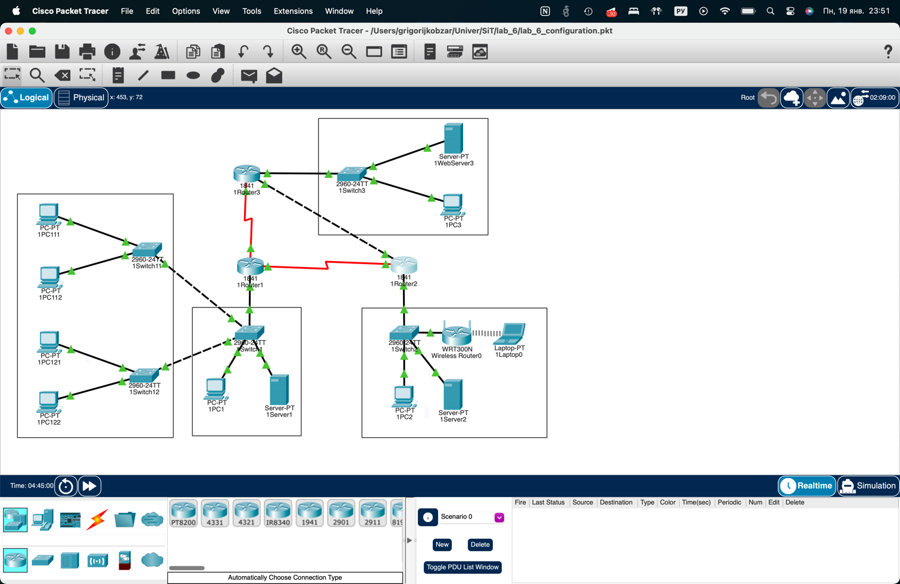

## Проверка до ACL

### Доступ к WebServer3 по HTTP
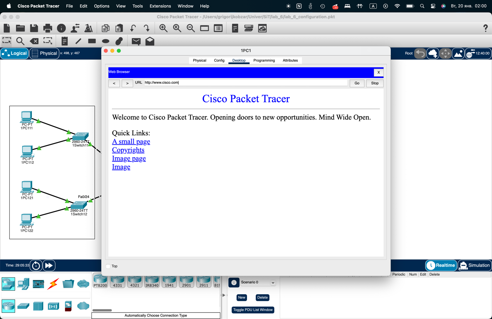

### FTP доступ к WebServer3
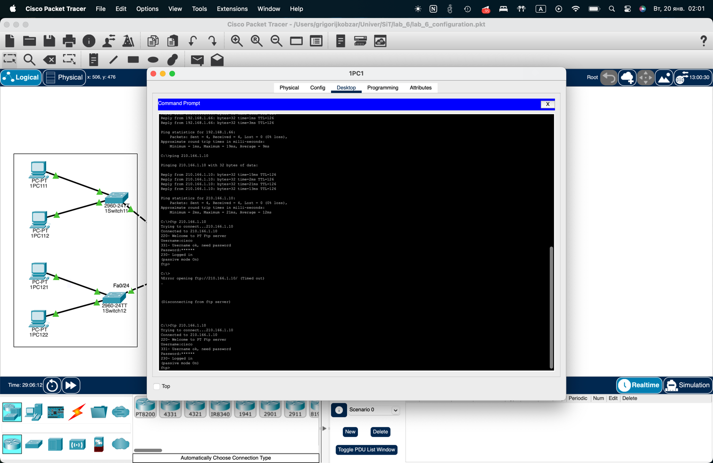

### Telnet на 1Router2 с 1PC3
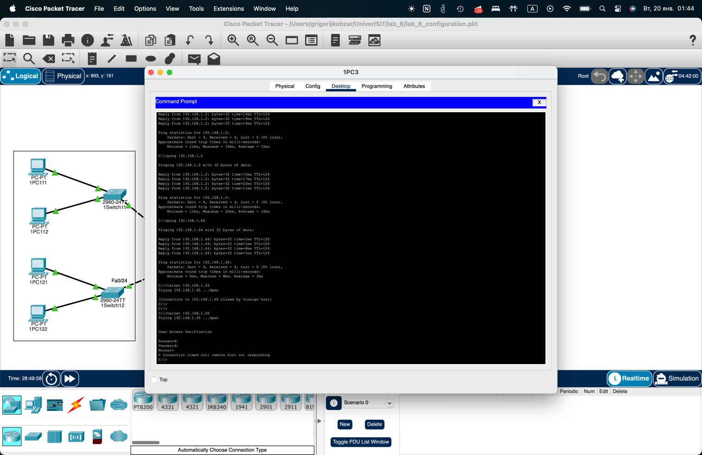

## ACL на 1Router2

### VTY access-class, Standard ACL для VTY, Standard named ACL, Extended ACL 100
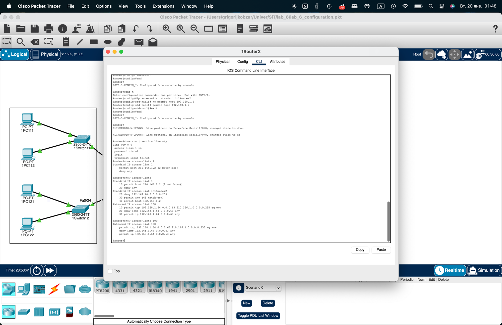

## Extended ACL 110/120 (Router1)

### ACL 110, ACL 120
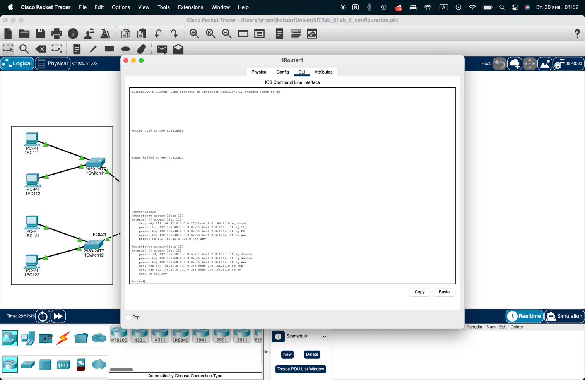

## Extended named ACL (Router3)

### ACL out1Router3
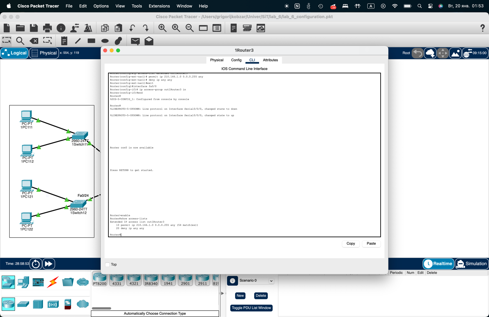

## Проверки после ACL

### Telnet: доступ только с 1PC3
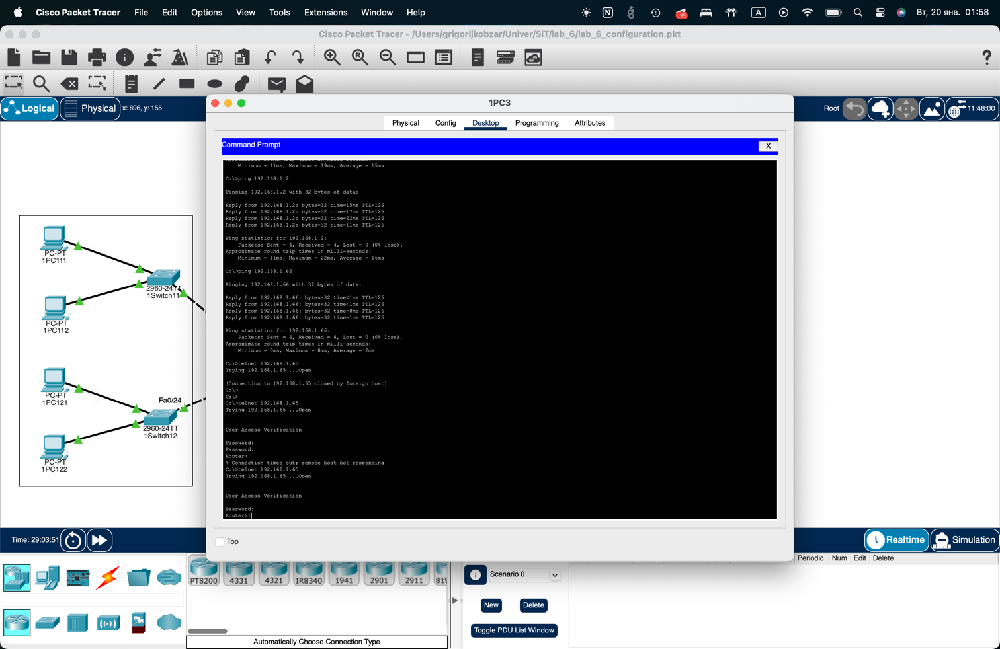

### Telnet: отказ с другого ПК
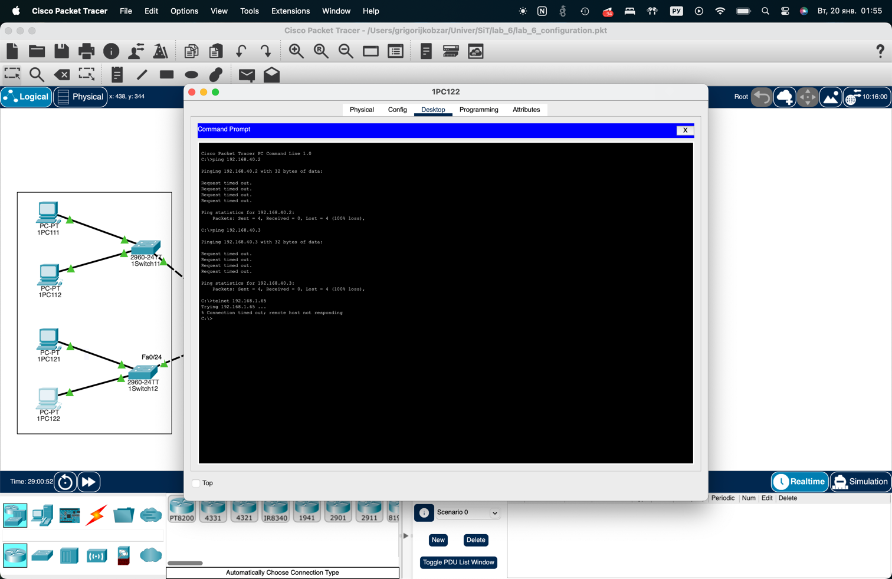

### VLAN10: HTTP/FTP разрешены, DNS запрещен
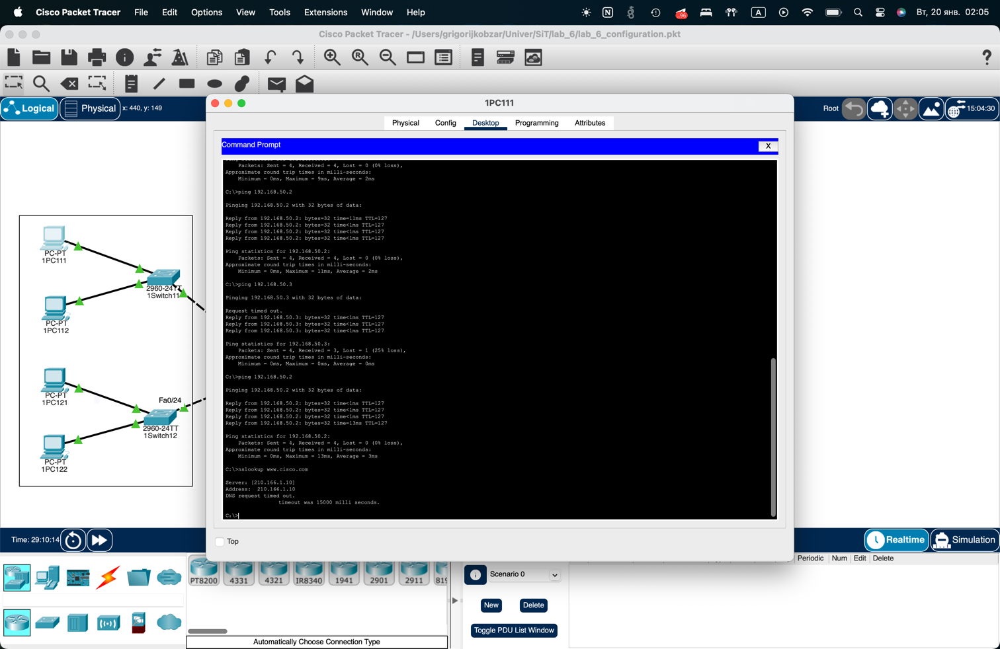

### VLAN20: DNS/HTTP разрешены, FTP запрещен
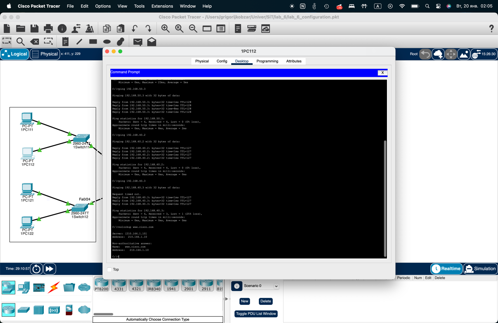

### Правая сеть: HTTP разрешен, ICMP запрещен

## Ответы на вопросы для самопроверки

1. **Когда лучше разрешить специальный трафик, а общий запретить?** Когда нужен строгий whitelist: разрешаем только конкретные сервисы/адреса.
2. **Когда лучше запретить специальный трафик, а общий разрешить?** Когда нужно точечно заблокировать отдельные протоколы, но остальное оставить открытым.
3. **Почему важно считать совпадения ACL?** Это помогает отладке и подтверждает, что ACL реально фильтрует трафик.
4. **Зачем планирование и тестирование ACL?** Неправильный порядок или место ACL может полностью отрезать нужные сервисы.
5. **Главное ограничение стандартных ACL:** фильтруют только по source IP.
6. **Как контролировать трафик ACL‑ами?** Указывать протоколы, адреса и порты, разрешая или запрещая нужные потоки.
7. **Последняя строка по умолчанию:** `deny any` (неявная).
8. **Что означает `out` в `ip access-group`?** Фильтрация трафика, выходящего из интерфейса.
9. **Разница ACL на интерфейсе и VTY:** интерфейс — `ip access-group`, VTY — `access-class`.
10. **Сокращения состояния порта:** `up/up`, `administratively down`.
